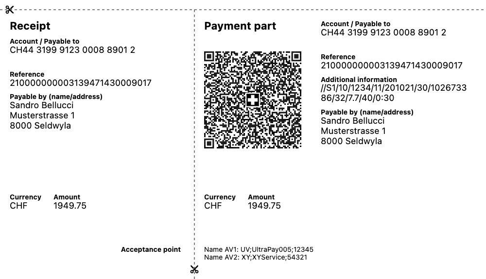

# Swiss QR Bill Library

The QR Bill library is a Flutter library for use in the development of Swiss payment QR bills and payment slips.



## Features

The library is composed of three classes:

* **QRBill.** The purpose of this class is as a data class, similar to a POJO, for the storing and transport of QR-bill data. Additionally, this class can validate that the data contained conforms to the Swiss Payment Standards (currently version 2.2).
* **QRGenerator.** This class allows the generation of the actual QR image used by a QR-bill, without the payment slip. Input is in the form of a QRBill, while output may be a Widget or PNG binary data.
* **BillGenerator.** This class will produce the full formatted QR-bill payment slip, outputted as PNG binary data for a single QR-bill or a PDF document containing one or more QR-bills (one per page). Input is in the form of a QRBill for single images and a QRBill list for PDF documents. Supported languages are *English*, *German*, *French* and *Italian*.

## Usage

Typically the `QRBill` class must always be imported as it is used as an input with the other two classes - either `QRGenerator` (for QR code generation) or `BillGenerator` (for payment slip / invoice generation).

A QR-bill Widget can be generated as follows:

```dart
import 'package:flutter/material.dart';
import 'package:qr_bill/qr_bill.dart';
import 'package:qr_bill/qr_generator.dart';

Future<Widget> getQRBillWidget(String rawQrCode, double size) async {
    QRBill qrBill = QRBill(data: rawQrCode);
    Widget? qrWidget;
    if (qrBill.isValid()) {
      QRGenerator qr = QRGenerator(qrBill);
      qrWidget = await qr.getWidget(size: size);
    }

    if (qrWidget == null) {
      return SizedBox(
        width: size,
        height: size,
        child: const Center(child: Text("QR data incorrectly formatted!")),
      );
    } else {
      return qrWidget;
    }
  }

```

To output a PDF document containing multiple QR payment slips:

```dart
import 'package:flutter/material.dart';
import 'package:qr_bill/qr_bill.dart';
import 'package:qr_bill/bill_generator.dart';

Future<File?> getInvoicesBinary(
      List<QRBill> qrBills, File fileToWrite) async {
  BillGenerator bills = BillGenerator(
    qrBills, 
    language: BillGenerator.german);
  Uint8List? bill = await bills.generateInvoices();
  return bill == null ? null : await fileToWrite.writeAsBytes(bill);
}
```
## Quick API Reference

### QRBill

* `QRBill QRBill({String data = ""})` Basic constructor.
* `QRBill QRBill.fromJson(Map<String, dynamic> json)` Deserializes the QRBill object from a JSON format.
* `Map<String, dynamic> toJson()` Serializes the QRBill object to a JSON format.
* `String toString()` Returns the QRBill object as a raw `String` used as the QR code.
* `bool isValid()` Returns if the QRBill strictly follows the specification.
* `List<QRBillException> qrExceptions` Returns a list of errors if the QRBill **does not** strictly follow the specification and an empty list **if it does**.
* Numerous `getters` and `setters` for the various Swiss QR bill attributes are also included.

### QRGenerator

* `QRGenerator QRGenerator(QRBill data)` Basic constructor.
* `Future<Widget?> getWidget({required double size, double margin = 0.05})` Outputs a single QR code (via the constructor) as a Flutter widget.
* `Future<ByteData?> getBinary({required double size, double margin = 0.05})` Outputs the binary data of a single QR code (via the constructor), in a PNG format.
* `drawCanvas(ui.Canvas c, {double margin = 0.0, required double size, Offset offset = const Offset(0.0, 0.0)})` Draws a single QR code (via the constructor), to a paint canvas. Principally used by `BillGenerator`.

### BillGenerator

* `BillGenerator BillGenerator(this.qrBills, {this.language = BillGenerator.english})` Basic constructor. Sets a list of QRBills for output, as well as the language to be employed.
* `Future<Uint8List?> getBinary(QRBill qrBill)` Outputs the binary data of a single Swiss QR bill payment slip, in a PNG format.
* `Future<Uint8List?> generateInvoices()` Outputs the binary data of all QRBills added with the constructor as Swiss QR bill payment slips, in a PDF format, one per page.